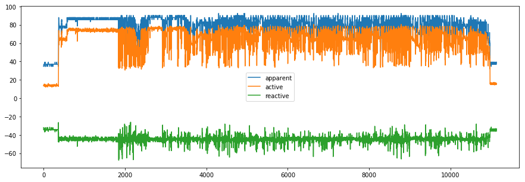
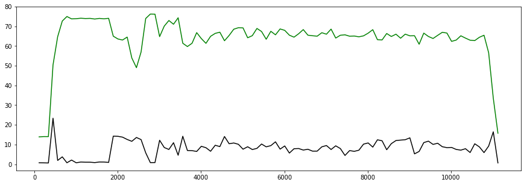
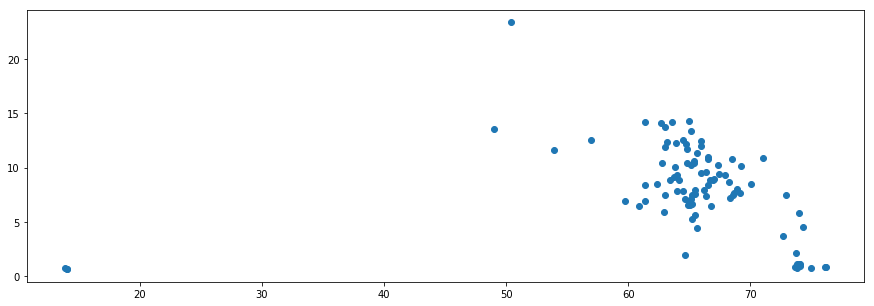

```python
import pandas as pd

data=pd.read_csv("cube_power.txt")

import seaborn as sns, numpy as np

import numpy as np
from scipy.stats import binned_statistic
```


```python
data.head()
```


<div>
<style scoped>
    .dataframe tbody tr th:only-of-type {
        vertical-align: middle;
    }

    .dataframe tbody tr th {
        vertical-align: top;
    }

    .dataframe thead th {
        text-align: right;
    }
</style>
<table border="1" class="dataframe">
  <thead>
    <tr style="text-align: right;">
      <th></th>
      <th>timestamp</th>
      <th>apparent</th>
      <th>active</th>
      <th>reactive</th>
    </tr>
  </thead>
  <tbody>
    <tr>
      <th>0</th>
      <td>2017-12-06 17:08:26.299163</td>
      <td>34.72</td>
      <td>13.54</td>
      <td>-31.9710</td>
    </tr>
    <tr>
      <th>1</th>
      <td>2017-12-06 17:08:26.463533</td>
      <td>34.72</td>
      <td>13.54</td>
      <td>-31.9710</td>
    </tr>
    <tr>
      <th>2</th>
      <td>2017-12-06 17:08:26.596592</td>
      <td>37.04</td>
      <td>13.70</td>
      <td>-34.4132</td>
    </tr>
    <tr>
      <th>3</th>
      <td>2017-12-06 17:08:26.751432</td>
      <td>37.04</td>
      <td>14.44</td>
      <td>-34.1094</td>
    </tr>
    <tr>
      <th>4</th>
      <td>2017-12-06 17:08:26.916437</td>
      <td>37.04</td>
      <td>14.44</td>
      <td>-34.1094</td>
    </tr>
  </tbody>
</table>
</div>


```python
np.array(data.head()[["active","reactive"]])
```


    array([[ 13.54  , -31.971 ],
           [ 13.54  , -31.971 ],
           [ 13.7   , -34.4132],
           [ 14.44  , -34.1094],
           [ 14.44  , -34.1094]])


```python
from matplotlib import pyplot as plt

matplotlib.rcParams['figure.figsize']=[15,5]
```


```python
data.rolling(1,1,win_type="boxcar").mean().plot.line()
```


    <matplotlib.axes._subplots.AxesSubplot at 0x7f0f8062ca58>





```python
bins=100
```


```python
bin_means, bin_edges, binnumber= binned_statistic(range(len(data.active)), np.array(data.active), bins=bins)
```


```python
bin_stds, bin_edges, binnumber= binned_statistic(range(len(data.active)), np.array(data.active), bins=bins,statistic=lambda x:np.std(x))
```


```python
plt.plot(bin_edges[1:],bin_stds,'k',bin_edges[1:],bin_means,'g')
```


    [<matplotlib.lines.Line2D at 0x7f0f7babe588>,
     <matplotlib.lines.Line2D at 0x7f0f7babe710>]





```python
plt.scatter(bin_means[:-5],bin_stds[:-5])
```


    <matplotlib.collections.PathCollection at 0x7f0f7bb08128>




