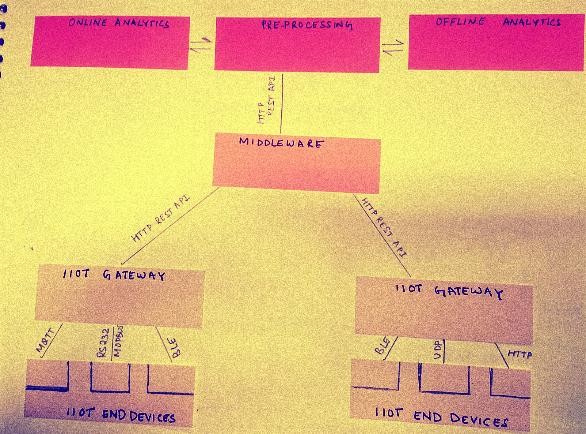
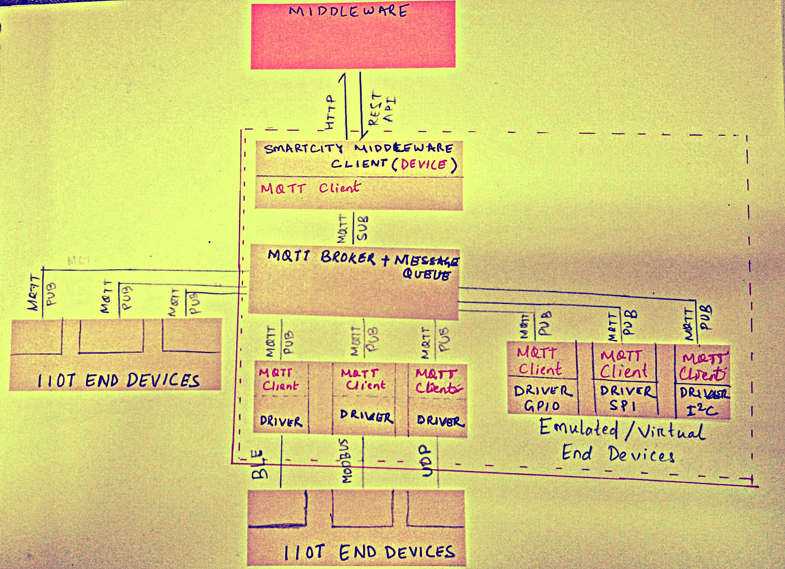

## 
 IIOT GATEWAY 

 
### Contents

- *Architecture*
- *Libraries/Tools*
- *Examples*

#### 1. Architecture
##### Overview

#### Details

#### 2. Libraries/Tools
- *[paho-mqtt python MQTT Client](https://pypi.python.org/pypi/paho-mqtt/1.1)*
- *[Smartcity Middleware Python Client](https://github.com/NeveIsa/RBCCPS/tree/master/docs/middleware-client)*
